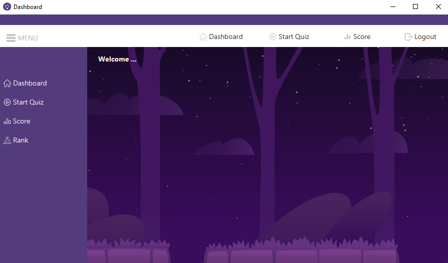

# Quiz Game 


*logo*

## Description
Un jeu de quiz interactif qui permet aux utilisateurs de tester leurs connaissances sur différents sujets. Les utilisateurs peuvent s'inscrire, se connecter et participer à des quiz. L'application offre une interface conviviale et garantit une authentification sécurisée.

## User Interface

### Home Screen

*Home screen with navigation options and welcome message*

### Authentication

*User login interface*


*New user registration form*

### User Dashboard

*Category and difficulty selection screen*

### Quiz Interface

*Category and difficulty selection screen*


*Quiz completion and score display*


## Fonctionnalités
- Inscription et connexion des utilisateurs
- Contrôle d'accès basé sur les rôles
- Quiz interactifs
- Gestion du profil utilisateur
- Intégration avec l'API Open Trivia Database (OpenTDB)
- Plusieurs catégories et niveaux de difficulté

## Intégration API
Cette application utilise l'[API Open Trivia Database (OpenTDB)](https://opentdb.com/) pour récupérer les questions :
- Plus de 4 000 questions vérifiées
- 24 catégories différentes
- Plusieurs niveaux de difficulté
- Utilisation gratuite et open-source

## Prérequis
- Java JDK 17 ou supérieur
- Maven 3.6 ou supérieur
- MySQL 8.0 ou supérieur

## Installation et Configuration

1. **Cloner le dépôt :**
   ```bash
   git clone https://github.com/projet-poo-java/quiz-game
   ```

2. **Créer une base de données MySQL :**
   - Créez une base de données nommée `quizgame`.
   - Importez et exécutez le fichier `quizgame.sql` dans MySQL Workbench.

3. **Configurer les informations de connexion :**
   - Modifiez votre nom d'utilisateur et mot de passe MySQL dans le fichier `DatabaseConnection.java`.

4. **Exécuter l'application :**
   - Lancez `App.java`.

## Licence

Ce projet est sous licence [MIT](https://opensource.org/licenses/MIT).


